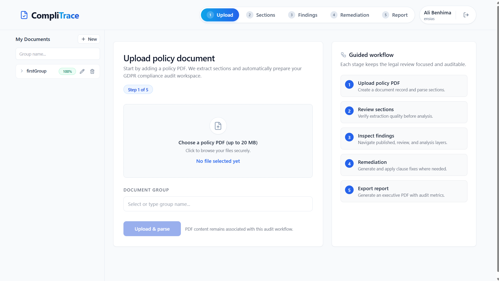
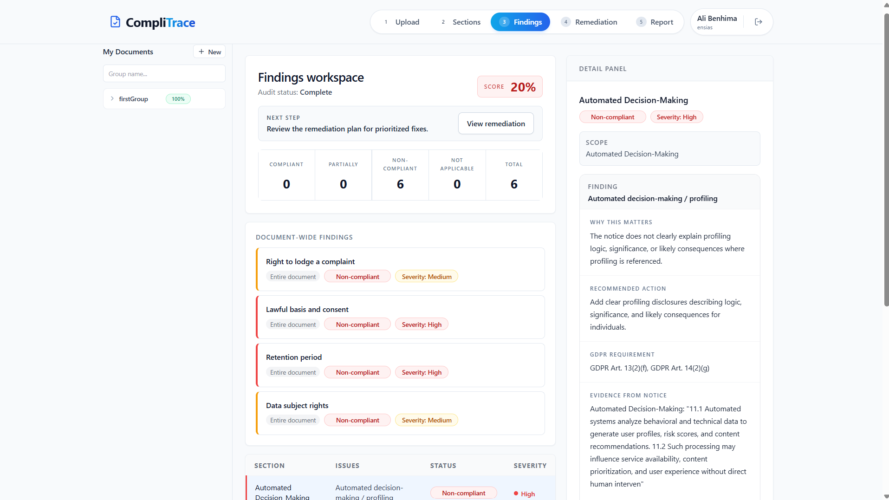
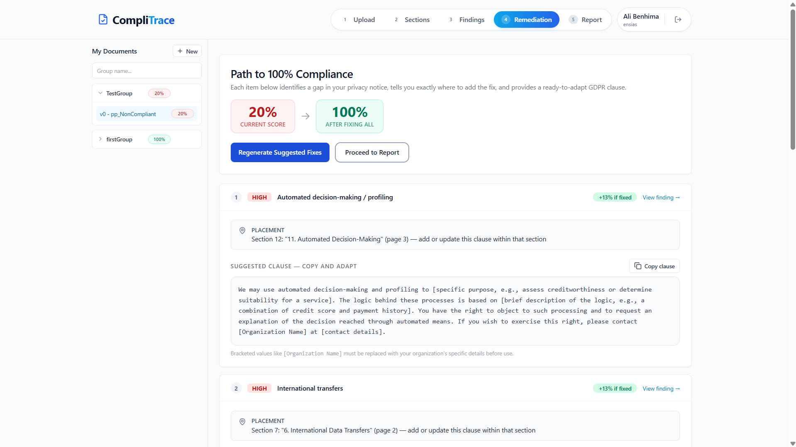
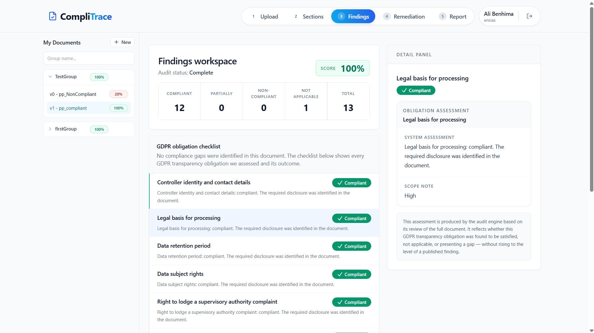
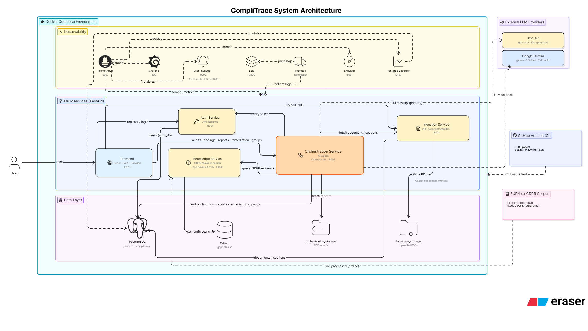
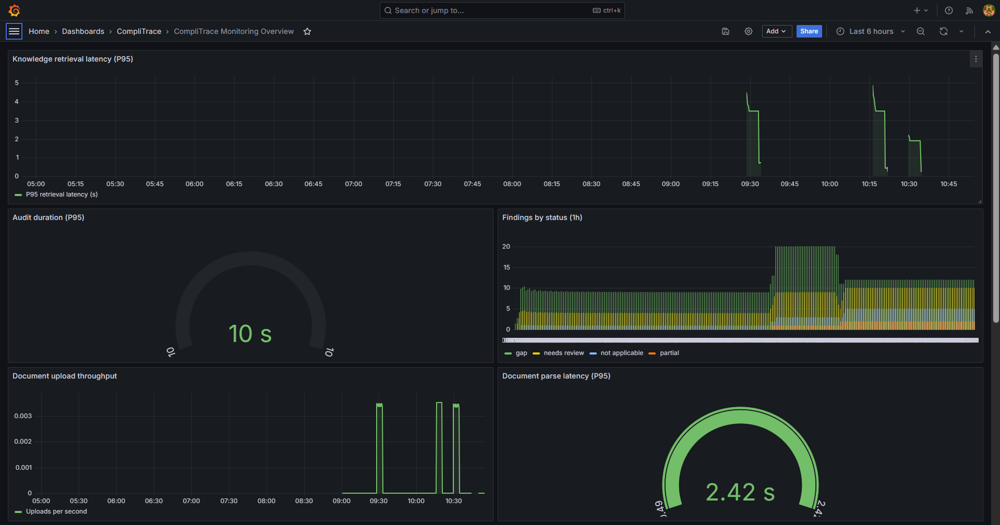
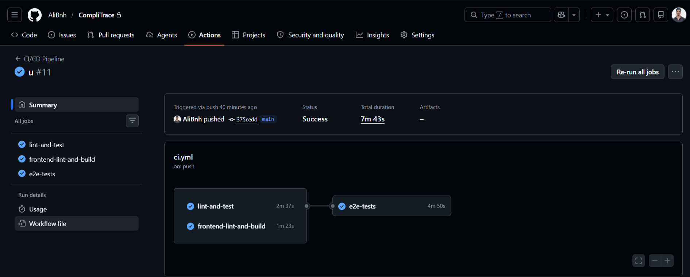
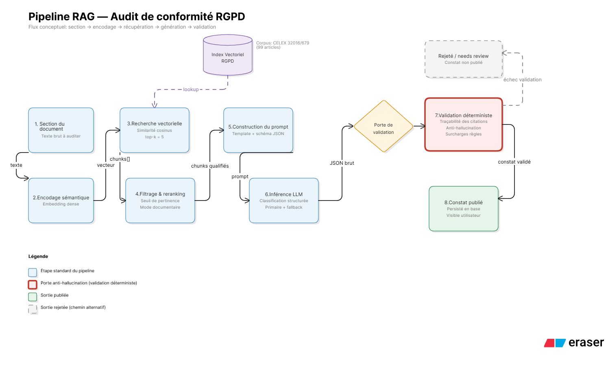

<p align="center">
  <h1 align="center">CompliTrace</h1>
  <p align="center">
    AI-powered GDPR compliance auditing — upload a privacy policy, get actionable findings in minutes.
  </p>
</p>

<p align="center">
  <a href="#quick-start">Quick Start</a> •
  <a href="#features">Features</a> •
  <a href="#architecture">Architecture</a> •
  <a href="#tech-stack">Tech Stack</a> •
  <a href="#api-reference">API</a> •
  <a href="#contributing">Contributing</a> •
  <a href="#license">License</a>
</p>

---

## What is CompliTrace?

CompliTrace is a microservices platform that performs automated first-pass GDPR compliance reviews on privacy policy documents. It combines **Retrieval-Augmented Generation (RAG)** with a **bounded AI agent** to produce citation-grounded findings, compliance scores, and remediation guidance — eliminating weeks of manual legal pre-screening.

**Key differentiator:** A multi-layer deterministic gating system ensures every finding is backed by verifiable GDPR article citations from the retrieved corpus. The agent cannot hallucinate legal references.

<p align="center">
  
</p>

---

## Features

| Capability | Description |
|-----------|-------------|
| 📄 PDF Ingestion | Upload any privacy policy PDF — automatic text extraction and section parsing |
| 🔍 RAG-based Analysis | Each section is matched against a vectorized GDPR corpus (Qdrant + bge-small-en-v1.5) |
| 🤖 Bounded AI Agent | Multi-pass audit with evidence gating, applicability checks, and contradiction controls |
| 📊 Compliance Scoring | Quantified score (0–100) based on duty satisfaction across core and specialist obligations |
| 🛠️ Remediation | LLM-generated fix suggestions tied to specific gaps |
| 📑 Report Generation | Downloadable structured compliance report |
| 🔐 Authentication | JWT-based auth with organization-scoped user accounts |
| 📈 Full Observability | Prometheus metrics, Grafana dashboards, Loki log aggregation, Alertmanager |
| 🚀 CI/CD | GitHub Actions pipeline — lint, test, build, e2e |

<p align="center">
  
  <br/><em>Findings view — each gap includes severity, legal citations, and evidence excerpts</em>
</p>

<p align="center">
  
  <br/><em>Actionable remediation suggestions ranked by compliance score impact</em>
</p>

<p align="center">
  
  <br/><em>A fully compliant policy — all GDPR obligations satisfied, 100% score</em>
</p>

---

## Architecture

<p align="center">
  
</p>

### Services

| Service | Port | Responsibility |
|---------|------|----------------|
| `frontend` | 5173 | React SPA — upload, findings, remediation, reports |
| `auth-service` | 8004 | User registration, login, JWT issuance/verification |
| `ingestion-service` | 8001 | PDF upload, text extraction (PyMuPDF), section splitting |
| `knowledge-service` | 8002 | GDPR vector search (Qdrant + fastembed) |
| `orchestration-service` | 8003 | Audit pipeline, LLM orchestration, reports, remediation |
| `postgres` | 5432 | Relational storage (two DBs: `complitrace` + `auth_db`) |
| `qdrant` | 6333 | Vector database for GDPR embeddings |

### Observability Stack

| Component | Port | Role |
|-----------|------|------|
| Prometheus | 9090 | Metrics scraping from all services |
| Grafana | 3001 | Dashboards and alerting visualization |
| Loki + Promtail | 3100 | Centralized structured log aggregation |
| Alertmanager | 9093 | Alert routing and notification |
| cAdvisor | 8081 | Container resource metrics |
| postgres-exporter | 9187 | PostgreSQL metrics |

<p align="center">
  
  <br/><em>Grafana dashboard — service health, audit latency, and LLM call metrics</em>
</p>

---

## Tech Stack

| Layer | Technologies |
|-------|-------------|
| **Frontend** | React 18, TypeScript, Vite, TailwindCSS, React Router |
| **Backend** | Python 3.11, FastAPI, SQLAlchemy 2.0, Pydantic |
| **AI/ML** | Groq API, Google Gemini API, fastembed (BAAI/bge-small-en-v1.5) |
| **Data** | PostgreSQL 16, Qdrant 1.12 |
| **DevOps** | Docker Compose, GitHub Actions, Prometheus, Grafana, Loki |
| **Testing** | pytest, Playwright (e2e), Ruff (lint/format) |

---

## Quick Start

### Prerequisites

- [Docker](https://docs.docker.com/get-docker/) & Docker Compose v2+
- A [Groq](https://console.groq.com/) API key (free tier works) **or** a [Google Gemini](https://aistudio.google.com/apikey) API key

### 1. Clone & configure

```bash
git clone https://github.com/<your-org>/CompliTrace.git
cd CompliTrace
cp .env.example .env
```

Edit `.env` and set your API keys:

```dotenv
GROQ_API_KEY=gsk_...
GEMINI_API_KEY=AIza...
AUTH_JWT_SECRET=generate-a-strong-random-secret
```

### 2. Launch

```bash
docker compose up --build -d
```

This starts all 14 containers. First boot takes ~2 minutes (embedding model download + GDPR corpus indexing).

### 3. Use

Open **http://localhost:5173** → Sign up → Upload a privacy policy PDF → Start audit.

### Verify services are healthy

```bash
docker compose ps
# or check the health endpoints:
curl http://localhost:8001/health  # ingestion
curl http://localhost:8002/health  # knowledge
curl http://localhost:8003/health  # orchestration
curl http://localhost:8004/health  # auth
```

---

## Environment Variables

| Variable | Required | Default | Description |
|----------|----------|---------|-------------|
| `GROQ_API_KEY` | Yes* | — | Groq API key for LLM inference |
| `GEMINI_API_KEY` | Yes* | — | Google Gemini API key (fallback) |
| `MODEL_PROVIDER` | No | `groq` | Primary LLM provider (`groq` or `gemini`) |
| `MODEL_NAME` | No | `llama-3.1-8b-instant` | Model identifier |
| `MODEL_TEMPERATURE` | No | `0.1` | LLM temperature |
| `AUTH_JWT_SECRET` | Yes | — | Secret for JWT signing (change in production!) |
| `MAX_LLM_CALLS_PER_AUDIT` | No | `80` | Safety cap on LLM calls per audit |
| `MAX_AUDIT_RUNTIME_SECONDS` | No | `600` | Audit timeout |
| `QDRANT_URL` | No | `http://qdrant:6333` | Qdrant connection |
| `CORPUS_VERSION` | No | `gdpr-2016-679-v1` | GDPR corpus version tag |

*At least one LLM provider key is required.

---

## Project Structure

```
CompliTrace/
├── apps/
│   ├── auth-service/          # JWT auth microservice
│   ├── ingestion-service/     # PDF parsing & section extraction
│   ├── knowledge-service/     # GDPR vector search (Qdrant)
│   ├── orchestration-service/ # Audit engine, reports, remediation
│   └── frontend/              # React SPA
├── infra/
│   ├── prometheus/            # Prometheus config & alert rules
│   ├── grafana/               # Dashboards & datasources
│   ├── alertmanager/          # Alert routing config
│   ├── loki/                  # Log aggregation config
│   ├── promtail/              # Log shipping config
│   └── postgres/              # DB init scripts
├── data/
│   ├── raw/                   # Source PDFs (GDPR regulation)
│   └── processed/             # Pre-chunked GDPR JSONL
├── scripts/                   # Ingestion & benchmark scripts
├── docker-compose.yml
├── .env.example
└── .github/workflows/ci.yml   # CI/CD pipeline
```

---

## API Reference

All backend services expose OpenAPI docs at `/docs` when running:

| Service | Swagger UI |
|---------|-----------|
| Ingestion | http://localhost:8001/docs |
| Knowledge | http://localhost:8002/docs |
| Orchestration | http://localhost:8003/docs |
| Auth | http://localhost:8004/docs |

### Key Endpoints

```
POST /documents              Upload PDF (multipart)
GET  /documents/:id/sections Get parsed sections
POST /audits                 Trigger compliance audit
GET  /audits/:id             Audit status & score
GET  /audits/:id/findings    Published findings
GET  /audits/:id/review      Structured review items
POST /audits/:id/report      Generate report
GET  /audits/:id/report/download  Download PDF report
POST /audits/:id/remediation Generate remediation suggestions
POST /auth/register          Create account
POST /auth/login             Get JWT token
```

---

## Development

### Run services individually (without Docker)

```bash
# Backend (example: orchestration-service)
cd apps/orchestration-service
pip install -r requirements.txt
uvicorn app.main:app --reload --port 8003

# Frontend
cd apps/frontend
npm install
npm run dev
```

### Lint & Format

```bash
# Python (all services)
ruff check apps/
ruff format apps/

# Frontend
cd apps/frontend && npm run lint
```

### Run Tests

```bash
# Backend tests
cd apps/orchestration-service && pytest tests/ -v --cov=app
cd apps/auth-service && pytest tests/ -v
cd apps/ingestion-service && pytest tests/ -v

# Frontend e2e
cd apps/frontend && npx playwright test
```

---

## CI/CD

The GitHub Actions pipeline (`.github/workflows/ci.yml`) runs on every push/PR to `main`:

1. **lint-and-test** — Ruff lint + format check, pytest for all Python services (with Postgres + Qdrant service containers)
2. **frontend-lint-and-build** — ESLint + TypeScript build
3. **e2e-tests** — Playwright test compilation verification

<p align="center">
  
  <br/><em>All CI jobs passing — lint, test, build, and e2e verification</em>
</p>

---

## Observability

Every service exposes a `/metrics` endpoint (Prometheus format) with custom counters and histograms:

- `audit_duration_seconds` — End-to-end audit latency
- `llm_inference_latency_seconds` — Per-call LLM response time
- `findings_by_status_total` — Finding distribution (compliant/partial/gap)
- `evidence_gate_failure_total` — Sections failing evidence threshold
- `auth_register_total` / `auth_login_total` — Auth activity

Access Grafana at **http://localhost:3001** (admin/admin) for pre-provisioned dashboards.

---

## How the Audit Pipeline Works

<p align="center">
  
</p>

---

## Contributing

1. Fork the repository
2. Create a feature branch (`git checkout -b feat/my-feature`)
3. Commit changes (`git commit -m "feat: add X"`)
4. Push to the branch (`git push origin feat/my-feature`)
5. Open a Pull Request

Please ensure:
- All tests pass (`pytest` + `npm run lint`)
- Code is formatted (`ruff format` + Prettier)
- New features include tests

---

## License

This project is licensed under the [MIT License](LICENSE).

---

<p align="center">
  <sub>Built with FastAPI, React, Qdrant, and a lot of GDPR reading.</sub>
</p>
